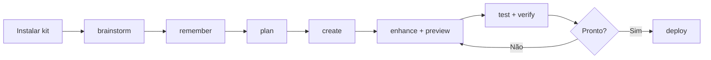
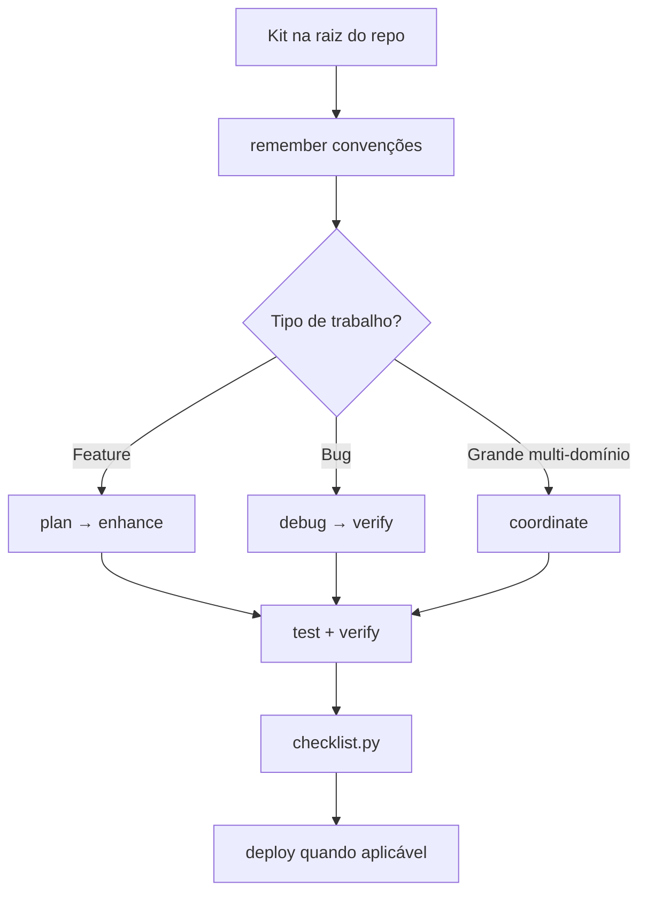

# antigravity4cursor

Port do [AG Kit](https://github.com/vudovn/ag-kit) (Antigravity Kit) para o **Cursor IDE** — agents, skills, workflows e scripts de validação, com paths e regras adaptados ao ecossistema Cursor.

---

## O que é

Este repositório inclui o pacote npm **`@zanetta/antigravity4cursor`** (pasta `cli/`) para instalação via `npx`. Também funciona como template git manual.

| Componente | Onde fica |
| --- | --- |
| 20 agents especialistas | `.claude/agents/` |
| 45 skills | `.agents/skills/` |
| 13 slash commands (+ `/ui-ux-pro-max`) | `.cursor/commands/` |
| Regras globais | `AGENTS.md` |
| Regras por domínio (auto-attach) | `.cursor/rules/*.mdc` |
| Memória persistente | `.agents/memory/` |
| Scripts de validação + sync | `.cursor/scripts/` |
| MCP (Context7, Playwright, shadcn) | `.cursor/mcp.json` |

Documentação detalhada: [`.cursor/ARCHITECTURE.md`](.cursor/ARCHITECTURE.md) · fluxo: [`AGENT_FLOW.md`](AGENT_FLOW.md)

---

## Quick Start

### 1. Instalar no seu projeto (recomendado)

Na raiz do projeto onde você desenvolve:

```bash
# One-shot (sem instalar globalmente)
npx @zanetta/antigravity4cursor init

# Ou instalação global
npm install -g @zanetta/antigravity4cursor
antigravity4cursor init
```

**O que o `init` copia (instalação full):**

| Item | Destino |
| --- | --- |
| Agents | `.claude/agents/` |
| Skills + memory | `.agents/` |
| Commands, rules, scripts, MCP | `.cursor/` |
| Regras globais | `AGENTS.md`, `AGENT_FLOW.md` |
| Template de env | `.env.example` |

**Modo merge (padrão):** arquivos novos são adicionados; arquivos que já existem são preservados. Exceções:

- **`.cursor/mcp.json`** — merge: servidores do kit são adicionados; os seus prevalecem em conflito de nome
- **`.cursor/rules/*.mdc`** — regras existentes não são sobrescritas

Para sobrescrever tudo (cuidado em projetos customizados):

```bash
npx @zanetta/antigravity4cursor init --force
```

Outros comandos:

```bash
npx @zanetta/antigravity4cursor status
npx @zanetta/antigravity4cursor update          # merge novos arquivos do kit
npx @zanetta/antigravity4cursor update --force  # sobrescrever kit inteiro
npx @zanetta/antigravity4cursor init --dry-run  # simular sem escrever
```

> **Publicação npm:** após `npm publish` no workspace `cli/`. Até lá, teste localmente:
> `ANTIGRAVITY4CURSOR_REPO=/caminho/antigravity4cursor node cli/bin/index.js init --path /tmp/meu-projeto`

### 2. Alternativa manual (sem npm)

Clone ou copie para a raiz do seu projeto de aplicação:

```bash
git clone https://github.com/zanetta/antigravity4cursor.git
# ou copie apenas .claude/, .agents/, .cursor/, AGENTS.md
```

### 3. Configurar MCP (opcional)

```bash
cp .env.example .env
# Edite CONTEXT7_API_KEY em .env
```

### 4. Slash commands no Cursor

Digite `/` no chat do **Agent** (modo Agent) para ver autocomplete, ou use os exemplos da seção [Como utilizar os comandos](#como-utilizar-os-comandos).

### 5. Validar o projeto

```bash
python3 .cursor/scripts/checklist.py .
python3 .cursor/scripts/verify_all.py . --url http://localhost:3000
```

---

## Como utilizar os comandos

Os slash commands ficam em `.cursor/commands/` e são invocados no **chat do Agent** do Cursor. A sintaxe é sempre:

```text
/<comando> [descrição em texto livre]
```

O texto após o comando é o contexto da tarefa — não use placeholders; descreva o que precisa em linguagem natural.

### Onde digitar

1. Abra o projeto no Cursor com esta pasta na raiz (ou com `.cursor/commands/` presente).
2. Use o painel **Agent** (não o Ask simples, para tarefas que alteram código).
3. Digite `/` — o Cursor deve sugerir os comandos disponíveis.
4. Complete com `/plan`, `/debug`, etc. e adicione o pedido na mesma mensagem.

### Referência de comandos

| Comando | Quando usar | Exemplo |
| --- | --- | --- |
| `/brainstorm` | Explorar opções e arquitetura **antes** de codar | `/brainstorm qual stack usar para um SaaS multi-tenant?` |
| `/plan` | Quebrar uma tarefa em plano e checklist | `/plan implementar autenticação JWT com refresh token` |
| `/create` | Criar feature nova ou app do zero | `/create landing page Next.js com formulário de waitlist` |
| `/enhance` | Melhorar código ou feature **existente** com segurança | `/enhance adicionar paginação na listagem de usuários` |
| `/debug` | Investigar bug com método sistemático | `/debug login retorna 401 após deploy` |
| `/test` | Gerar ou executar testes | `/test cobrir fluxo de checkout com Playwright` |
| `/verify` | **Executar** e provar que funciona (não só ler código) | `/verify build passa após o refactor do módulo auth` |
| `/deploy` | Pré-flight checks e deploy | `/deploy preparar release para Vercel` |
| `/preview` | Subir ou checar servidor de preview local | `/preview iniciar dev server na porta 3000` |
| `/status` | Relatório do progresso da tarefa atual | `/status` |
| `/orchestrate` | Multi-agente clássico (mín. 3 specialists) | `/orchestrate painel admin com CRUD e testes E2E` |
| `/coordinate` | Orquestração avançada (paralelo + síntese) | `/coordinate revisar segurança e performance da API em paralelo` |
| `/remember` | Salvar preferência ou convenção entre sessões | `/remember prefiro bun em vez de npm neste projeto` |
| `/ui-ux-pro-max` | Design system com estilos/paletas (Cursor-only) | `/ui-ux-pro-max dashboard fintech dark mode minimalista` |

### Fluxo recomendado por tipo de tarefa

**Feature nova (média/grande complexidade)**

```text
/brainstorm [ideia e restrições]
/plan [escopo fechado após brainstorm]
/create ou /enhance [implementação]
/test [cobertura]
/verify [provar que roda]
/deploy [quando estiver pronto]
```

**Bug ou comportamento estranho**

```text
/debug [sintoma, erro, passos para reproduzir]
/verify [confirmar que o fix funciona]
```

**Tarefa full-stack ou multi-domínio**

```text
/coordinate [visão geral]   ← paralelo, fases Research → Synthesis → Implementation
/orchestrate [visão geral]  ← alternativa com mínimo 3 agents
```

**Convenções do projeto (persistir)**

```text
/remember sempre usar Tailwind v4, nunca v3
/remember API base URL em staging é https://api.staging.example.com
```

Memória salva em `.agents/memory/` e reutilizada em sessões futuras via skill `memory-system`.

### Dicas

- **Seja específico** — quanto mais contexto após o comando, melhor o resultado (`/debug` com stack trace, URL, passos).
- **Um comando por mensagem** — evite misturar `/plan` e `/create` na mesma linha; encadeie em mensagens separadas.
- **Modo Agent** — comandos que editam arquivos precisam de permissão para alterar o workspace.
- **Memória** — use `/remember` para decisões que o agente deve repetir (stack, estilo, URLs); não para segredos (use `.env`).
- **Validação manual** — após `/verify` ou `/deploy`, você pode rodar também:

  ```bash
  python3 .cursor/scripts/checklist.py .
  ```

Definições completas de cada workflow: arquivos em [`.cursor/commands/`](.cursor/commands/).

---

## Fluxo de desenvolvimento

Guia prático de como encadear comandos e validações do kit — do zero até deploy. Use como roteiro; adapte ao tamanho do projeto.

### Novo projeto (greenfield)

Cenário: você vai criar uma aplicação do zero (ex.: SaaS, app interno, MVP).

#### Fase 0 — Instalar o kit no repositório

```bash
# Na pasta do novo repo (vazio ou recém-criado)
npx @zanetta/antigravity4cursor init
git add . && git commit -m "chore: add antigravity4cursor kit"
```

Alternativa manual: copie `.claude/`, `.agents/`, `.cursor/`, `AGENTS.md` deste repositório.

Configure MCP se for usar Context7/Playwright via [`.cursor/mcp.json`](.cursor/mcp.json).

#### Fase 1 — Descoberta e decisões

| Passo | Comando | Objetivo |
| --- | --- | --- |
| 1 | `/brainstorm` | Comparar stacks, riscos, escopo do MVP |
| 2 | `/remember` | Fixar decisões (ex.: Next.js 15, Postgres, Tailwind v4) |
| 3 | `/plan` | Plano com milestones, pastas e checklist |

Exemplo de sequência no Agent:

```text
/brainstorm MVP de gestão de tarefas: web, auth, equipes, mobile depois. Restrição: deploy na Vercel.

/remember Stack: Next.js App Router, Prisma, PostgreSQL, Tailwind v4, bun. Sem tons roxo/violeta na UI.

/plan MVP com auth email/senha, CRUD de projetos e tarefas, dashboard. Incluir testes e schema DB.
```

Para escopo grande ou full-stack desde o início, considere `/coordinate` ou `/orchestrate` **depois** do `/plan`, para revisar arquitetura com múltiplos specialists.

#### Fase 2 — Scaffold e implementação

| Passo | Comando | Objetivo |
| --- | --- | --- |
| 1 | `/create` | Gerar estrutura inicial (app, API, DB conforme o plano) |
| 2 | `/ui-ux-pro-max` | Definir direção visual (opcional, antes ou junto do UI) |
| 3 | `/preview` | Subir dev server e validar localmente |
| 4 | `/enhance` | Iterar features do plano, uma por vez |

```text
/create seguir o plano em [nome-do-plano].md — monorepo não, app Next.js na raiz.

/ui-ux-pro-max dashboard produtividade, estilo clean, paleta neutra com acento verde.

/preview iniciar dev server e confirmar que a home carrega.
```

Implemente **incrementalmente**: conclua um bloco do plano → `/verify` → próximo bloco. Evite pedir “faça tudo” num único `/create`.

#### Fase 3 — Qualidade contínua

Durante o desenvolvimento, após cada entrega relevante:

```text
/test unitários para services de tarefas e integração para API /api/projects

/verify rodar build, migrations e smoke test do fluxo login → criar tarefa

/status
```

No terminal:

```bash
python3 .cursor/scripts/checklist.py .
```

#### Fase 4 — Pré-deploy e release

```text
/coordinate revisão final: segurança (auth), performance (LCP), testes E2E dos fluxos críticos

/deploy preparar release produção Vercel — variáveis de ambiente e migrations
```

Validação completa:

```bash
python3 .cursor/scripts/verify_all.py . --url http://localhost:3000
```

#### Visão do fluxo (novo projeto)



---

### Projeto já iniciado (brownfield)

Cenário: o código já existe; você adiciona o kit ou já o usa e precisa evoluir o produto sem recomeçar do zero.

#### Passo 1 — Adicionar o kit sem quebrar o repo

Na raiz do projeto existente:

```bash
npx @zanetta/antigravity4cursor init
```

Modo **merge** (padrão): preserva `.cursor/rules/` e `mcp.json` customizados; adiciona o restante do kit. Use `--force` apenas se quiser sobrescrever tudo.

Alternativa manual: copie as pastas do kit sem substituir `package.json`, `src/` nem configs do app.

Revise conflitos:

- Se já existir `.cursor/` com configs suas, **mescle** manualmente (`commands/`, `rules/`, `mcp.json`).
- Documente convenções existentes com `/remember` em vez de sobrescrever código.

```text
/remember Este projeto usa npm (não bun). ESLint flat config em eslint.config.mjs. API em src/server/.
```

Opcional: peça ao Agent um mapa rápido antes de mudanças grandes:

```text
Explorar a estrutura do repo e resumir: stack, pastas principais, como rodar testes e build.
```

(O agent `explorer-agent` e a skill `architecture` ajudam nessa leitura.)

#### Passo 2 — Entender antes de mudar

| Situação | Comando sugerido |
| --- | --- |
| Nova feature no código existente | `/plan` → `/enhance` |
| Refatoração ou dívida técnica | `/brainstorm` opções → `/plan` → `/enhance` |
| Bug em produção ou staging | `/debug` → `/verify` |
| Feature full-stack tocando várias camadas | `/coordinate` ou `/orchestrate` |

Exemplo — nova feature:

```text
/plan adicionar exportação CSV na listagem de pedidos — respeitar padrões em src/features/orders/

/enhance implementar export CSV async, limite 10k linhas, testes unitários no service

/test cobrir service de export e rota GET /api/orders/export

/verify build + testes + curl na rota com token de teste
```

Exemplo — bug:

```text
/debug checkout falha no Safari iOS — cart fica vazio após refresh. Logs e passos anexados.

/verify reproduzir fix no fluxo guest checkout e logged-in
```

#### Passo 3 — Ritmo de trabalho no dia a dia

1. **Início de sessão** — leia `.agents/memory/MEMORY.md` ou peça: “Quais convenções deste projeto estão na memória?”
2. **Tarefa pequena** — `/enhance` ou pedido direto no Agent (com rules por domínio já ativas).
3. **Tarefa média** — `/plan` curto → implementação → `/verify`.
4. **Antes de PR** — `/test` + `python3 .cursor/scripts/checklist.py .`
5. **Antes de merge/release** — `/verify` + `/deploy` (ou pipeline CI equivalente)

#### Passo 4 — Evitar armadilhas em projeto existente

| Evitar | Preferir |
| --- | --- |
| `/create` para reescrever app inteiro | `/enhance` + plano incremental |
| Ignorar padrões já no código | `/remember` + seguir estilo existente |
| Deploy sem `/verify` | Provar build/testes na sessão |
| Segredos no `/remember` | `.env` + `.env.example` |

#### Visão do fluxo (projeto existente)



---

## Diferenças vs AG Kit upstream

| Upstream (Gemini/Antigravity) | Este port (Cursor) |
| --- | --- |
| `.agents/agent/` | `.claude/agents/` |
| `.agents/workflows/` | `.cursor/commands/` |
| `GEMINI.md` | `AGENTS.md` + `.cursor/rules/*.mdc` |
| `$ARGUMENTS` nos workflows | Texto livre após o comando |
| Auto-routing nativo | Documentado; aplicado pelo agente quando relevante |
| `npx @vudovn/ag-kit init` | `npx @zanetta/antigravity4cursor init` |

Limitações completas: seção **Limitações da migração** em [`AGENTS.md`](AGENTS.md).

---

## Sync com upstream (ag-kit)

Mantenha paridade com [vudovn/ag-kit](https://github.com/vudovn/ag-kit):

```bash
# Comparar (dry-run)
python3 .cursor/scripts/sync_upstream.py

# Aplicar sync: agents, skills, memory, commands (adaptados ao Cursor)
python3 .cursor/scripts/sync_upstream.py --apply

# Clonar upstream fresh antes de sync
python3 .cursor/scripts/sync_upstream.py --apply --clone
```

O script:

- Copia **agents** de `.agents/agent/` → `.claude/agents/` (paths Cursor)
- Copia **skills** e **memory**
- Converte **workflows** → `.cursor/commands/` (`$ARGUMENTS` → texto livre)
- **Preserva** `/ui-ux-pro-max` (comando exclusivo Cursor)
- **Não sobrescreve** `AGENTS.md`, `.cursor/rules/`, `README.md`

Recomendação: rode dry-run após cada release upstream; revise diff antes de `--apply` em projetos customizados.

---

## Estrutura resumida

```
.
├── AGENTS.md                 # Regras sempre-ativas
├── AGENT_FLOW.md             # Diagrama de fluxo
├── cli/                      # @zanetta/antigravity4cursor (npm)
├── .claude/agents/           # 20 personas
├── .agents/
│   ├── skills/               # 45 skills
│   └── memory/               # Memória cross-session
└── .cursor/
    ├── ARCHITECTURE.md
    ├── commands/             # /plan, /debug, …
    ├── rules/                # frontend, backend, …
    ├── scripts/              # checklist, sync_upstream
    ├── shared/ui-ux-pro-max/
    └── mcp.json
```

---

## `.gitignore` e indexação do Cursor

**Não** coloque `.agents/` no `.gitignore` do projeto se quiser autocomplete dos slash commands no Cursor.

Para excluir do remoto sem perder indexação local:

```bash
echo ".agents/" >> .git/info/exclude
```

(Conforme [recomendação upstream](https://github.com/vudovn/ag-kit#-important-note-on-gitignore).)

---

## Créditos e licença

- Baseado em [AG Kit / Antigravity Kit](https://github.com/vudovn/ag-kit) por [vudovn](https://github.com/vudovn) — MIT License
- Port Cursor: [zanetta/antigravity4cursor](https://github.com/zanetta/antigravity4cursor)
